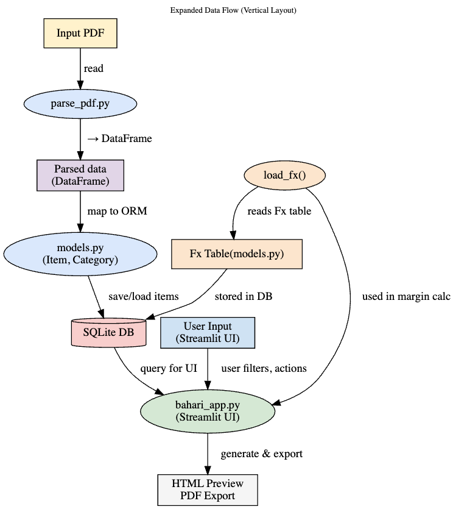

A set of concepts for databases and workflows for Bahari Foods

**Pricing**
***Workflow***
- Tables to hold exchange rates, items (skus) and assumptions on  margin rates
- Basic UI to handle CRUD operations 
- Customizable reporting

***How to***
- Load seed data w/ _parse_pdf.py Pricelist CIF DAR January.pdf_ 
- Run app w/ _python -m barhari_app.py_

***Deployment Plan***
- Rebuild this workflow with a robust enterprise level solution
- Currently exploring self-hosted Retool with a Supabase database

***ERD***

